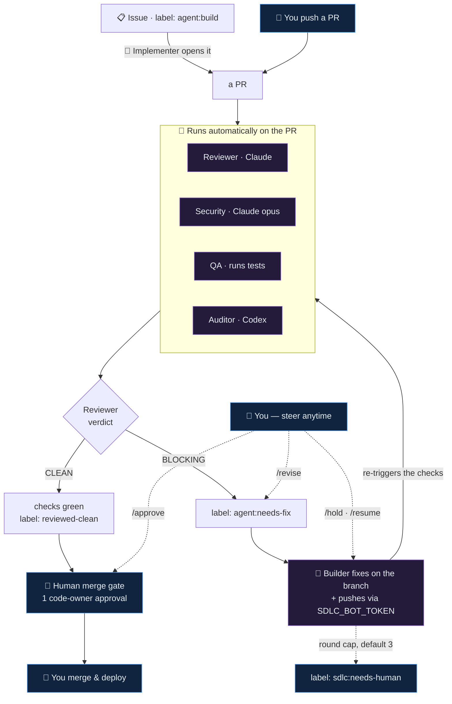
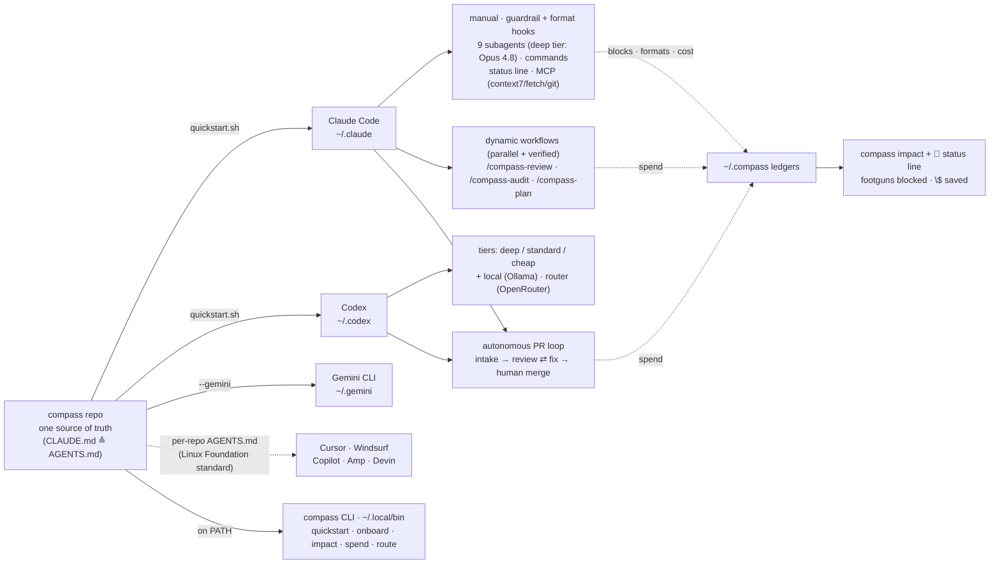

<div align="center">

# 🧭 compass

### One config that turns Claude Code, Codex, and Gemini into your most senior engineer — by default, in every repo.

It reads before it changes, stays in scope, and verifies before it says "done." It blocks the catastrophic, formats every edit, spends the cheap model on cheap work, and can even open and fix its own PRs. You install it once. You always merge.

*Linting made bad code visible. CI made it unmergeable. compass makes a careless agent harmless — by default.*

[](https://github.com/dshakes/compass/actions/workflows/ci.yml)
[](https://github.com/dshakes/compass/releases)
[](LICENSE)
[](docs/05-plugin.md)
[](https://agents.md/)
[](#safety-honesty-and-status)

</div>

<p align="center">
  
</p>

<p align="center">
  <b><a href="#install">Install in one command ↓</a></b> &nbsp;·&nbsp; <a href="demo/preview.gif">▶ 30-second demo</a> &nbsp;·&nbsp; <a href="#autonomous-sdlc">🔁 the self-fixing PR loop</a> &nbsp;·&nbsp; <a href="docs/11-using-compass.md">📚 start here</a>
</p>

---

<div align="center">

### ⭐ The part people screenshot: it fixes its own PRs.

Open a pull request and compass **reviews it, security-checks it, runs the tests, cross-audits it with a second model — then pushes its own fixes until it's green.** You just merge. *(Try it locally in 30 seconds, no tokens — [jump to it ↓](#autonomous-sdlc).)*

</div>

<p align="center">
  <a href="#autonomous-sdlc"></a>
</p>
<p align="center"><sub>A real run (PR #4): Reviewer flagged the bug → Builder pushed the fix → re-review went green → you merge.</sub></p>

---

## Why compass?

> **The 60-second pitch.** AI agents can finally write real code — but they ship like a brilliant intern with no judgment: no taste, no guardrails, no sense of cost. Everyone has the same models, so that's not where the edge is. **The edge is configuration** — what the agent knows by default, what it's allowed to do, and which model does which job. compass *is* that configuration: one install, every agent, every repo. The work it can't safely own, it hands back to you — **you keep the merge.**

You already pair with an AI coding assistant. Out of the box, it's brilliant but **green** — a talented new hire on their first day who has never read your standards. So it does what new hires do: it guesses your conventions, it'll happily run a command that wreaks havoc, and it reaches for the most expensive model to rename a variable. You end up re-explaining the same rules in every repo and watching it like a hawk.

**compass is the onboarding that new hire never got.** It's a small set of readable config files that, installed once, makes your assistant behave like a *principal engineer by default* — in every repo, across every tool. It understands the task before touching code, keeps changes in scope, and proves its work runs before it claims success. It hard-blocks the handful of truly catastrophic actions, quietly formats every file it edits, and routes the bulk of the work to cheap, fast models. Everything beyond those basics is opt-in, nothing runs that you didn't enable, and **a human always owns the merge.**

No app. No service. No `curl | sh`. Just files you can read, audit, and `git pull` to update.

> **One prerequisite:** compass *configures* an assistant — it doesn't replace one. Install **[Claude Code](https://code.claude.com)** first (Codex or Gemini CLI optional).

<div align="right"><a href="#contents">↑ top</a></div>

---

<div id="contents"></div>

**Contents** &nbsp;·&nbsp; [Why compass?](#why-compass) &nbsp;·&nbsp; [What you get](#what-you-get) &nbsp;·&nbsp; [Install](#install) &nbsp;·&nbsp; [See it work](#see-it-work) &nbsp;·&nbsp; [Autonomous SDLC](#autonomous-sdlc) &nbsp;·&nbsp; [How it fits together](#how-it-fits-together) &nbsp;·&nbsp; [The crew](#the-crew-9-subagents-12-commands-3-workflows) &nbsp;·&nbsp; [Guardrails](#guardrails-and-automation) &nbsp;·&nbsp; [The compass CLI](#the-compass-cli) &nbsp;·&nbsp; [Connected & extensible](#connected-and-extensible) &nbsp;·&nbsp; [Cost model](#cost-model) &nbsp;·&nbsp; [Safety & status](#safety-honesty-and-status) &nbsp;·&nbsp; [Docs](#docs)

---

## What you get

The whole point is **less friction and fewer nasty surprises**, in every repo, for free. Here's the trade you're making:

| Without compass | With compass |
|---|---|
| You re-explain your conventions in every new repo | **One operating manual** every agent follows, everywhere |
| One wrong command can wreck your machine or leak a secret | **Disasters hard-blocked before they run** — `rm -rf /`, secret writes, force-push to `main` |
| Messy diffs; you reformat by hand | **Every edit auto-formatted** — clean, review-ready, silent |
| The pricey model does trivial work, slowly | **Cheap models do the grunt work**; Opus only where a wrong answer is expensive — and it's *faster* |
| "Done" means "it looks right" | **"Done" means it ran** — the agent verifies before it claims |
| Code review is one slow, single-pass opinion | **A panel of agents reviews in parallel** and fact-checks each other before reporting |
| You babysit the AI through every change | **It opens PRs and fixes its own review findings** — you just merge |
| You can't tell if any of this is helping | **It proves its worth** — footguns blocked and `$` saved, live in your status line |

Everything above is on after a single install. Here's what's in the box, each link jumps to the detail:

- ⭐ **It runs your PRs — and fixes its own review comments.** The headline: an optional [autonomous pipeline](#autonomous-sdlc) reviews, security-checks, tests, and cross-audits every change, then pushes its *own* fixes until it's green. You just merge. (Try it locally in 30 seconds, no tokens.) [→](#autonomous-sdlc)
- ✅ **A senior crew on call.** 9 cost-tiered specialist subagents, 12 slash-commands, and 3 parallel "dynamic workflows" that review and audit in parallel and fact-check each other. [→](#the-crew-9-subagents-12-commands-3-workflows)
- ✅ **Every agent, one source.** Claude Code, Codex, Gemini — plus Cursor / Windsurf / Copilot via the open [`AGENTS.md`](https://agents.md/) standard — read the *same* playbook. Switch or mix vendors without rewriting a thing. [→](#connected-and-extensible)
- ✅ **Guardrails that stay out of your way.** 4 hooks block disasters, format edits, and orient the agent — silently. [→](#guardrails-and-automation)
- ✅ **It onboards you and proves its value.** `compass onboard` gets you productive in a new repo in minutes; `compass impact` shows what it saved. [→](#the-compass-cli)
- ✅ **Cheaper by design, measurably.** Model routing is now scored against an eval set and gated in CI. [→](#cost-model)

<div align="right"><a href="#contents">↑ top</a></div>

---

## Install

**Pick the door that fits.** All four are reversible, version-pinnable, and use **no `curl | sh`** — you can read every line before you trust it.

> **What you need first:** an AI assistant — **[Claude Code](https://code.claude.com)** (Codex or Gemini CLI optional) — plus `git`. **No API keys, no tokens, nothing to sign up for** to get the manual, guardrails, crew, and CLI. Tokens come in *only* if you turn on the cloud [autonomous SDLC](#autonomous-sdlc).

### 🍺 Homebrew — *managed & versioned*

```bash
brew tap dshakes/compass https://github.com/dshakes/compass
brew install dshakes/compass/compass     # latest release · add --HEAD to track main
compass quickstart                       # previews, asks, then wires it into ~/.claude
```

`brew upgrade compass` updates it; `compass --version`-style pinning comes from the tag you installed. The formula is right here in the repo — [`Formula/compass.rb`](Formula/compass.rb) — read it first.

### 📦 Git clone — *own and edit your config (recommended)*

```bash
git clone https://github.com/dshakes/compass ~/compass && cd ~/compass
git checkout v0.9.0      # optional: pin to a release instead of tracking main
./quickstart.sh
```

The repo stays on disk *as* your live config: edit a file and your agent changes; `git pull` updates everything. This is the full experience — `quickstart.sh` previews every change, asks first, backs up what it replaces, and is fully reversible (`make uninstall`).

### 🧩 Claude Code plugin — *no terminal, no clone*

Paste inside Claude Code — ideal for a team:

```text
/plugin marketplace add dshakes/compass
/plugin install core@compass
```

You get the machinery (agents, commands, hooks, MCP) without touching your personal global config. Pin a whole team to a release tag in a committed `.claude/settings.json` — see [Team rollout](docs/05-plugin.md).

### 🛠️ By hand — *watch every step*

```bash
git clone https://github.com/dshakes/compass ~/compass && cd ~/compass
make dry-run        # preview every change, touch nothing
make install        # symlink into ~/.claude + ~/.codex + the compass CLI
make doctor         # validate the whole install

make apply-many DIRS="~/code/*"            # …or roll it out across many repos at once
make new-repo DIR=/path/to/repo [TEAM=1]   # …or commit per-repo config (+ team pin)
```

Symlink install means `git pull` (or `brew upgrade`) updates everything; use `./install.sh --copy` to snapshot instead, or `--gemini` to also feed Gemini CLI.

→ **New here?** [Using compass](docs/11-using-compass.md) walks through the pieces in plain language and the daily workflow.

<div align="right"><a href="#contents">↑ top</a></div>

---

## See it work

<p align="center">
  
</p>
<p align="center"><sub>Guardrails · cost-aware status line · the self-fixing PR loop · the crew — in ~25 seconds. (<a href="demo/preview.gif">open full size</a>)</sub></p>

A normal session after install — there's nothing extra to invoke:

1. **Open any repo.** The manual, guardrails, 9 subagents, 12 commands, and the live status line are already loaded.
2. **Ask for a change.** It plans, implements, and hands the test run to a cheap Haiku subagent while Opus stays on the hard parts. Every file it touches is auto-formatted.
3. **Dangerous command?** `rm -rf $HOME`, a secret write, a force-push to `main` → **blocked before it runs.** `rm -rf ./build` sails straight through.
4. **`/ship`, then open the PR.** The [autonomous loop](#autonomous-sdlc) reviews, security-checks, tests, and cross-audits — and **fixes its own Blocking findings** on the branch until it's green. You review and merge.

And the **status line** quietly keeps score, so you can see it earning its keep:

```text
Opus 4.8 · myrepo · main* · 45k ctx · $1.23 · 🧭 🛡1 🧹2 💡1 📉~$1.65
```

<sub>model · directory · git branch · context size · session spend — then today's compass activity: **🛡** footguns blocked · **🧹** files auto-formatted · **💡** policy nudges · **📉~$** estimated saved versus running everything on Opus. Each piece shows only when there's something to report, and nothing ever leaves your machine.</sub>

<div align="right"><a href="#contents">↑ top</a></div>

---

## Autonomous SDLC

**An AI engineering team that opens your PRs, fixes its own review comments, and stops at the merge button.**

> **This is the headline — and you can watch it work in 30 seconds, with no tokens and no GitHub setup.** It scales in two steps:
> 1. **Run it locally, right now** — `~/compass/sdlc/orchestrate.sh "<task>"` (or `/sdlc`) runs the whole plan→build→review→audit→security→QA pipeline and opens a PR, using just your logged-in CLI. *No tokens.* This is the fastest way to feel it.
> 2. **Make it always-on** — wire up the GitHub loop *(below)* and it runs on **every PR automatically**, fixing its own review findings until green. *Adds tokens.*
>
> Either way it stops at the PR — **you keep the merge.** (Already sold? Jump to [turn it on](#what-youll-need-to-turn-it-on).)

*Opt-in, and the part people screenshot.* Turn it on and compass becomes a pipeline of **named, governed agents** — Planner · Builder · Reviewer · **Auditor (Codex)** · Security · QA · Releaser — that plan, build, review, cross-audit, security-check, and test a change. When the Reviewer flags something **Blocking**, the **Builder fixes it on the branch and pushes**, and the Reviewer runs again — looping until it's green or it hits a round cap and asks for a human. Agents stop at the PR. **You keep the merge and deploy gates.**

<p align="center">
  
</p>

<p align="center"><sub>↑ the architecture. The same loop running on a <b>real PR</b> is the animation at the top of this page — Reviewer flagged a bug → Builder pushed the fix → re-review went green → you merge. (<a href="sdlc/SMOKETEST.md">reproduce it yourself</a>)</sub></p>

**Three ways to kick it off — only the merge is ever yours:**

- **Locally:** `~/compass/sdlc/orchestrate.sh "Add rate limiting to the login endpoint"` runs the whole pipeline and opens a PR.
- **From a comment:** drop `@claude <task>` on an issue or PR.
- **Zero-touch:** label an issue **`agent:build`** and an Implementer turns it into a PR automatically (maintainer-gated).

**Steer it from any PR comment, don't babysit it:** `/revise <note>` sends it back with your guidance, `/hold` · `/resume` pause and continue, `/approve` marks it merge-ready. A sticky status panel always shows the loop's state and what's waiting on you.

**Pick where it runs:**

| Way to run it | Runs on | Auth | API credits? | Manage a box? |
|---|---|---|---|---|
| **Hosted + subscription token** *(simplest)* | GitHub's runners | `CLAUDE_CODE_OAUTH_TOKEN` | **No** | No |
| **Self-hosted, keyless** | your runner (VM / laptop) | logged-in `claude -p` | No | Yes |
| **Hosted + API key** | GitHub's runners | `ANTHROPIC_API_KEY` | Yes (pay-per-use) | No |
| **Local, no cloud** | your machine | your CLI login | No | No |

#### What you'll need to turn it on

The local `orchestrate.sh` path needs none of these — just your logged-in CLI. The always-on GitHub loop needs:

| What | Why | How to get it |
|---|---|---|
| A **GitHub repo** + the **`gh`** CLI | the loop lives in GitHub Actions on your PRs | `gh auth login`; hosted runs also need the [Claude GitHub App](https://github.com/apps/claude) installed |
| **`CLAUDE_CODE_OAUTH_TOKEN`** | auth for Claude in the workflows — uses your **subscription, no API credits** | run `claude setup-token` |
| **`SDLC_BOT_TOKEN`** | a fine-grained **PAT** so the Builder's push re-triggers the Reviewer (the loop *chains*) | GitHub → Settings → fine-grained PAT, scoped to the repo, **Contents + Pull requests: write** |
| **`ANTHROPIC_API_KEY`** *(alt)* | use a pay-per-use API key instead of the subscription token | [console.anthropic.com](https://console.anthropic.com) |
| **`OPENAI_API_KEY`** *(optional)* | only for the **Codex** cross-audit step | [platform.openai.com](https://platform.openai.com) |

```bash
# GitHub-native closed loop (Reviewer ⇄ Builder until green):
export CLAUDE_CODE_OAUTH_TOKEN=…   # from `claude setup-token` — subscription, no API credits
export SDLC_BOT_TOKEN=…            # fine-grained PAT (Contents + Pull requests: write) — lets the loop chain
export OPENAI_API_KEY=…            # optional — the Codex cross-audit
~/compass/sdlc/setup.sh --all      # labels + workflows + CODEOWNERS + secrets + branch protection
```

`setup.sh` prompts for and stores these as repo secrets for you. The loop auto-chains **only** with `SDLC_BOT_TOKEN` (GitHub blocks workflow-to-workflow recursion with the default token); without it, the review and one fix still run. Validated end-to-end on a live repo — see [`sdlc/SMOKETEST.md`](sdlc/SMOKETEST.md). Roster, gates, security posture, and troubleshooting: [`docs/09-sdlc.md`](docs/09-sdlc.md).

**The same loop, as a text diagram:**



<div align="right"><a href="#contents">↑ top</a></div>

---

## How it fits together

One repo is the **single source of truth.** One command symlinks it into your tools, so *editing the repo edits your live config* — and `git pull` updates everything at once. The same manual reaches every major agent through the open `AGENTS.md` standard, so there's no drift between tools.



→ Full breakdown of how each piece maps into the runtime: [Architecture](docs/01-architecture.md).

<div align="right"><a href="#contents">↑ top</a></div>

---

## The crew: 9 subagents, 12 commands, 3 workflows

compass turns one assistant into a **team of specialists**, each scoped to a job and pinned to the right-sized (and right-priced) model.

### 9 specialist subagents, cost-tiered

A subagent reads dozens of files and runs long searches in its *own* context, then hands back a short conclusion — so your main session stays fast and cheap. compass ships nine, deliberately spread across three model tiers so spend follows difficulty:

| Tier | Model | Subagents | For |
|---|---|---|---|
| **Deep** | Opus 4.8 | `architect` · `security-auditor` · `debugger` | architecture, security review, subtle bugs |
| **Standard** | Sonnet 4.6 | `code-reviewer` · `go-engineer` · `rust-engineer` · `docs-writer` · `k8s-operator` | most coding, review, and docs |
| **Cheap** | Haiku 4.5 | `test-runner` | running tests, parsing failures, log triage |

### 12 commands — one-keystroke senior workflows

Saved, repeatable procedures you invoke by name. They live in `claude/commands/` as plain markdown, so adding your own is trivial.

| | | |
|---|---|---|
| `/ship` — test → review → clean commit | `/review` — review the current diff | `/tdd` — write the failing test first |
| `/spec` — draft intent + acceptance criteria | `/pr` — open a PR from the diff | `/triage` — root-cause a failure |
| `/adr` — record a load-bearing decision | `/scaffold` — new module to convention | `/cost` — re-plan a task to spend less |
| `/sdlc` — run the full autonomous pipeline | `/team-review` — parallel reviewer team | `/onboard` — get productive in a new repo |

### 3 dynamic workflows — a panel, not a single opinion

Claude Code's newest primitive (research preview): a workflow is a small script that fans out **many subagents in parallel** and has them **adversarially verify each other** before anything reaches you — so the result is faster *and* more trustworthy than one pass. compass's three route each stage to the cost-tiered crew above, so cost still follows risk.

| Command | How it works | Use it for |
|---|---|---|
| **`/compass-review`** | reviews the diff on 5 dimensions at once → a skeptic tries to refute each finding → one verdict | a deeper, less noisy review before you ship |
| **`/compass-audit`** | six blind finders sweep the codebase, looping until two empty rounds → a 2-of-3 panel confirms each | a thorough bug & security audit |
| **`/compass-plan`** | drafts a plan from 3 angles → a judge panel scores them → synthesizes the winner | a hard, ambiguous change worth getting right |

→ [Dynamic workflows in depth](docs/13-workflows.md) · [Cost & model routing](docs/02-cost-and-models.md)

<div align="right"><a href="#contents">↑ top</a></div>

---

## Guardrails and automation

Hooks are the part that runs *for* you on every action — the difference between advice and enforcement. compass's are deliberately balanced: they stop the handful of things that are almost never intended, do the chores you'd forget, and otherwise stay completely invisible. They're dependency-light (jq → python3 → grep) and **never fail a session.**

**On by default — you don't invoke these, they just happen:**

| Hook | Fires | What it does for you |
|---|---|---|
| **`protect-paths`** | before a command runs | **Blocks** secret writes, `rm -rf /` `~` `$HOME`, fork bombs, `curl \| sh`, and force-push / hard-reset to `main` — while letting real subpaths like `./build` through |
| **`format-on-edit`** | after every edit | Formats the file with its canonical formatter (gofmt, rustfmt, prettier/biome, ruff, shfmt, terraform, buf) — clean diffs, zero effort |
| **`inject-context`** | at session start | Hands the agent the branch, dirty state, and recent commits up front, so it starts oriented |
| **`notify`** | on finish / waiting | A desktop ping when a turn completes or needs your input (macOS / Linux) |

**Opt-in — flip them on in `settings.json` when you want more discipline:**

| Hook | What it does |
|---|---|
| **`route-intent`** | Nudges toward an ADR, a spec, or a security pass when your prompt looks load-bearing |
| **`require-tests`** | Nudges when source changes land with **no test diff** — advisory, never blocks |
| **`checkpoint-wip`** | Snapshots uncommitted work to a scratch ref so a crash or compaction never loses it |

> **Honest framing:** guardrails *reduce footguns* — they are not a security boundary. Keep least-privilege credentials and review your diffs. → [Practices](docs/07-practices.md)

<div align="right"><a href="#contents">↑ top</a></div>

---

## The compass CLI

`make install` (or `quickstart.sh`) puts a **`compass` command** on your PATH — your cockpit for local agentic work, and the answer to *"is this actually helping me?"*

| Command | What it does for you |
|---|---|
| **`compass quickstart`** | Install + validate + the 60-second on-ramp, in one command. Re-run anytime to repair. |
| **`compass status`** `[dir]` | **Is compass enabled here?** Shows the global config plus this repo's per-repo extras. |
| **`compass onboard`** `[dir]` · `--all <glob>` | Detect the stack → install deps → get build + test green → write a grounded `CLAUDE.md` → print a codebase map. `--all` does many repos with a per-repo budget cap. |
| **`compass impact`** | **What compass saved you:** footguns blocked, files auto-formatted, spend by model, and an estimated `$` saved versus running everything on Opus. |
| **`compass spend`** `[--week\|--month]` | Agent cost rolled up by model and repo, against a budget (`COMPASS_BUDGET_USD`). |
| **`compass route`** `"<task>"` · `--eval` | Picks the cheapest-correct model tier for a task. `--eval` scores the picker against a labeled set — gated in CI, so it's a measured claim, not a guess. |
| **`compass schedule`** `add\|run <routine>` | Local cron agents that open PRs/issues and never merge: `dep-refresh` · `flaky-triage` · `doc-freshness` · `pr-babysit`. |
| **`compass doctor`** | Validate the whole install (JSON, hooks, plugin sync, executability). |

Everything logs best-effort to `~/.compass/` ledgers, locally — nothing is uploaded anywhere.

<div align="right"><a href="#contents">↑ top</a></div>

---

## Connected and extensible

compass plugs your agent into live context and other tools — and bends easily to your own setup.

**MCP servers — one manifest, both tools.** [`mcp/servers.json`](mcp/servers.json) registers Model Context Protocol servers in **both** Claude and Codex, skipping anything that would duplicate your existing plugins. Run `make mcp`, then `claude mcp list` to verify.

- **Auto-registered, secret-free:** **`context7`** (up-to-date library docs, so the agent stops hallucinating old APIs) · **`fetch`** (URL → markdown) · **`git`** (structured git operations).
- **Opt-in:** **`github`** (issues/PRs over OAuth) · **`postgres`** (read-only, project-scoped) · **`browser`** (drive a real browser via Playwright) · **`compass-memory`** (durable, cross-repo learnings, local SQLite v1).

**Language-server intelligence (LSP).** An opt-in companion plugin gives Claude background **diagnostics + navigation at zero context cost** for Go, Rust, TypeScript, and Python — install it with `/plugin install core-lsp@compass` (needs `gopls` / `rust-analyzer` / `typescript-language-server` / `pyright` on PATH). → [LSP guide](docs/06-lsp.md)

**Bring your own model.** The cheapest token is one you don't pay for. Codex talks to any OpenAI-compatible endpoint, so the cheap tier can run on a **local model** (`--profile local` → Ollama, zero API cost) or a **cost router** (`--profile router` → OpenRouter). → [Cost & models](docs/02-cost-and-models.md)

**One manual, every agent.** `AGENTS.md` — the open standard under the Linux Foundation, read by Codex, Cursor, Windsurf, Copilot, Amp, and Devin — is a symlink to `CLAUDE.md`, globally and per-repo. Edit the manual once; every tool reads the same instructions. → [Every agent, one source](docs/12-every-agent.md)

**Make it yours.** It's a starting point, not scripture. The global `CLAUDE.md` has a clearly-marked stack section you can delete if you're not polyglot AI-infra, and your own agents/commands/skills drop in as plain markdown — picked up automatically. → [Customize](docs/03-customize.md)

<div align="right"><a href="#contents">↑ top</a></div>

---

## Cost model

The single biggest lever on agent cost is **which model does which job** — token *counts* dwarf per-token price differences, so routing the bulk of the work (mechanical, high-volume) to cheap models while reserving Opus for the calls where a wrong answer is expensive wins on **both cost and speed.**

| Tier | Model | Does | Roughly |
|---|---|---|---|
| **Cheap** | Haiku 4.5 | test runs, log triage, mechanical sweeps | ~1/18 the per-token cost of Opus |
| **Standard** | Sonnet 4.6 | most coding, review, and docs | ~1/5 the per-token cost of Opus |
| **Deep** | Opus 4.8 | architecture, security, subtle debugging | the expensive model, used sparingly |

You don't have to think about it — delegation happens automatically. When you want control, `/cost` re-plans a task into the cheapest-correct mix before you spend, and `compass route "<task>"` picks a tier deterministically (now **scored against a labeled eval set and gated in CI**). Every autonomous step is hard-capped by budget, and `compass spend` / `compass impact` show you exactly where the money went and what you saved. → [Cost & models](docs/02-cost-and-models.md)

<div align="right"><a href="#contents">↑ top</a></div>

---

## Safety, honesty and status

compass is built to be **trusted before it's run** — and honest about its limits.

- **You own the irreversible.** Agents prepare; humans push, merge, and deploy. Required checks plus a code-owner approval enforce it — there is no "merge to prod" button.
- **Readable and reversible.** No `curl | sh`. The installer backs up anything it replaces to `~/.claude/backups/`, is idempotent, and `make uninstall` removes only what it added. Pin a tagged release, not `main`.
- **Guardrails reduce footguns; they are not a security boundary.** Keep least-privilege credentials and review your diffs.
- **Grounded, not invented.** Every capability maps to a real, documented Claude Code / Codex primitive — there's a cited mapping (and an honest note on what we *didn't* fabricate) in [`docs/07-practices.md`](docs/07-practices.md). Built on [Anthropic's best practices](https://code.claude.com/docs/en/best-practices), the [agents.md](https://agents.md/) standard, and Garry Tan's [`gstack`](https://github.com/garrytan/gstack).

> **Status: alpha.** The core — manual, hooks, subagents, commands, MCP, plugin — is stable and dogfooded daily. The **SDLC pipeline** is newer: proven end-to-end on a pilot repo, treat it as early. **Dynamic workflows** are a Claude Code research preview (need v2.1.154+). The human merge/deploy gate is permanent, by design.

<div align="right"><a href="#contents">↑ top</a></div>

---

## Docs

| Doc | What's in it |
|---|---|
| [**Using compass**](docs/11-using-compass.md) | **start here** — install, the pieces in plain language, the daily workflow |
| [00 · Philosophy](docs/00-philosophy.md) | the operating beliefs behind every choice |
| [01 · Architecture](docs/01-architecture.md) | how each piece maps into the runtime |
| [02 · Cost & models](docs/02-cost-and-models.md) | the delegation / routing model |
| [03 · Customize](docs/03-customize.md) | add your own agents / commands / skills |
| [04 · MCP](docs/04-mcp.md) | single-source server parity across tools |
| [05 · Plugin](docs/05-plugin.md) | marketplace + team rollout |
| [06 · LSP](docs/06-lsp.md) | language-server intelligence |
| [07 · Practices](docs/07-practices.md) | cited best practices (and what's folklore) |
| [08 · Defaults](docs/08-defaults.md) | making it the default for new repos |
| [09 · SDLC](docs/09-sdlc.md) | the autonomous governed pipeline, human-gated |
| [10 · Roadmap](docs/10-roadmap.md) | where it's going, grounded in real harness primitives |
| [12 · Every agent](docs/12-every-agent.md) | one manual for Claude Code, Codex, Gemini, Cursor, Copilot |
| [13 · Dynamic workflows](docs/13-workflows.md) | parallel, adversarially-verified subagent orchestration |
| [ADRs](docs/adr/) | load-bearing decisions (cross-repo memory; autonomous-loop trust boundary) |

<div align="center"><br><sub>MIT · built to be shared · contributions welcome</sub></div>
