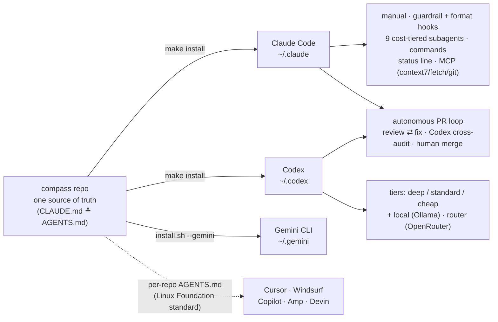
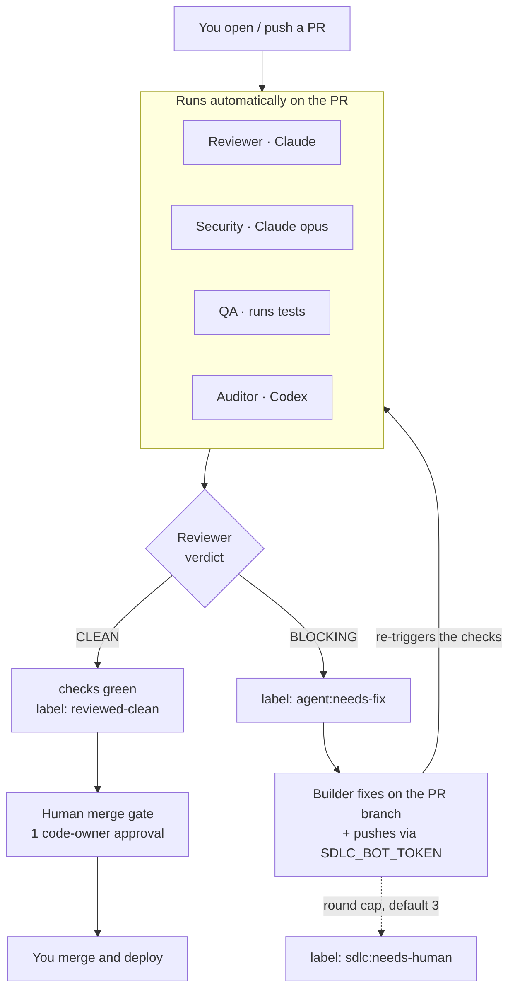

<div align="center">

# 🧭 compass

**One config that turns Claude Code, Codex, and Gemini into your most senior engineer — by default, in every repo.**

[](https://github.com/dshakes/compass/actions/workflows/ci.yml)
[](https://github.com/dshakes/compass/releases)
[](LICENSE)
[](docs/05-plugin.md)
[](https://agents.md/)
[](#status)

</div>

<p align="center">
  
</p>

<sub>▶ <a href="demo/preview.gif">terminal demo</a> · 📐 <a href="assets/hero.svg">architecture diagram</a> · 🔁 <a href="#autonomous-sdlc">the autonomous PR loop</a></sub>

---

## What is compass?

You already code with an AI assistant — **Claude Code, Codex, Gemini CLI, Cursor**. Out of the box it's a blank slate: no taste, no guardrails, no memory of how *you* work — so you re-explain the same rules in every repo, nothing stops a destructive command, and it burns the pricey model on trivial work.

**compass is one configuration that fixes that everywhere at once.** Install it once and your assistant acts like a senior engineer *by default* — reads before it changes, stays in scope, verifies before "done" — while **hard-blocking** the catastrophic (`rm -rf /`, secret writes, force-push to `main`), auto-formatting every edit, and routing cheap work to cheap models. It's not an app or a service — just small, **readable** config files you audit before trusting (no `curl | sh`). Everything past the basics — including a loop that **fixes its own PR review findings** — is **opt-in**, and *you* always merge.

> **Prerequisite:** compass *configures* an AI coding assistant; it doesn't replace one. Install **[Claude Code](https://code.claude.com)** (optionally Codex or Gemini CLI) first.

<div align="right"><a href="#contents">↑ top</a></div>

---

## What you get

- **Every agent, one config.** Claude Code, Codex, and Gemini — plus Cursor/Windsurf via the open `AGENTS.md` standard — follow the same senior-engineer playbook in *every* repo: understand first, stay in scope, verify before "done."
- **It stops the disasters.** Hard-blocks `rm -rf /`, secret writes, `curl | sh`, and force-push to `main`; auto-formats every edit — silently, before anything runs.
- **It costs less.** Grunt work goes to cheap models, Opus is saved for the hard calls, and the status line shows live `$` spend.
- **It brings a crew.** 9 specialist subagents and 11 commands (`/ship` `/review` `/tdd` …), each pinned to the right-sized model.
- **It can run your PRs.** An optional autonomous loop reviews, security-checks, tests, cross-audits, and **auto-fixes its own findings** — you keep the merge gate. Turn on as little or as much as you want; nothing you don't enable ever runs.

<div align="right"><a href="#contents">↑ top</a></div>

---

## Install

> **Need first:** at least one supported assistant — [Claude Code](https://code.claude.com), Codex, or Gemini CLI.

Pick **one** path (running both double-fires the hooks):

**A · Full setup** — *just you, every repo.* The manual, guardrails, status line, subagents, commands, and MCP, global to every repo. Fully reversible.

```bash
git clone https://github.com/dshakes/compass ~/compass && cd ~/compass
make dry-run     # preview every change
make install     # symlink into ~/.claude + ~/.codex (backs up first)
make doctor      # validate everything
```

**B · Plugin only** — *a team, or you'd rather not touch your global config.* The machinery, without your personal memory/permissions. Paste inside Claude Code — no terminal:

```text
/plugin marketplace add dshakes/compass
/plugin install core@compass
```

**Across many repos at once:** `make apply-many DIRS="~/code/*"`, then `make doctor`. Uninstall is always one command — `make uninstall` removes only what it added.

→ **New here? Start with [Using compass](docs/11-using-compass.md)** — the pieces in plain language (plugins vs skills vs hooks), the daily workflow, and how to stay cheap + fast.

<div align="right"><a href="#contents">↑ top</a></div>

---

## Contents

- [What is compass?](#what-is-compass)
- [What you get](#what-you-get)
- [Install](#install)
- [See it work](#see-it-work)
- [How it fits together](#how-it-fits-together)
- [What's inside](#whats-inside)
- [The hooks](#the-hooks)
- [Cost model](#cost-model)
- [MCP servers](#mcp-servers)
- [Language servers (LSP)](#language-servers-lsp)
- [New or existing repos](#new-or-existing-repos)
- [Team rollout](#team-rollout)
- [Autonomous SDLC](#autonomous-sdlc)
- [Cross-tool: one source](#cross-tool-one-source)
- [Grounded in published practice](#grounded-in-published-practice)
- [Customizing](#customizing)
- [Safety and honesty](#safety-and-honesty)
- [Status](#status)
- [Docs](#docs)

---

## See it work

<br>

<p align="center">
  
</p>

<p align="center"><sub>Guardrails · cost-aware status line · the self-fixing PR loop · the crew — in ~25s. (<a href="demo/preview.gif">open full size</a>)</sub></p>

<br>

After `make install`, a normal session — nothing extra to invoke:

1. **Open any repo.** Manual, guardrails, 9 subagents, 11 commands, and the cost-aware status line are already loaded.
2. **Ask for a change.** Claude plans, implements, and sends the test run to a cheap Haiku subagent — Opus stays for the hard parts. Every edit is auto-formatted.
3. **Dangerous command?** `rm -rf $HOME`, a secret write, force-push to `main` → **blocked before it runs**. `rm -rf ./build` sails through.
4. **`/ship`, then open the PR.** The [Autonomous SDLC](#autonomous-sdlc) reviews, security-checks, tests, and cross-audits — and **fixes its own Blocking findings** on the branch until green. You merge.

<div align="right"><a href="#contents">↑ top</a></div>

---

## How it fits together

One repo is the source of truth; `make install` **symlinks** it into your tools, so editing the repo edits your live config — and `git pull` updates everything. The same manual (via the `AGENTS.md` standard) reaches every major agent.



<div align="right"><a href="#contents">↑ top</a></div>

---

## What's inside

| Area | What you get | Lives in |
|---|---|---|
| **Operating manual** | `CLAUDE.md` (≙ `AGENTS.md`), loaded every session | `claude/CLAUDE.md` |
| **Guardrail + quality hooks** | protect-paths · format-on-edit · inject-context · notify | `claude/hooks/` |
| **Specialist subagents** (9) | cost-tiered across Haiku / Sonnet / Opus | `claude/agents/` |
| **Workflow commands** (11) | `/ship` `/review` `/tdd` `/spec` `/pr` `/adr` `/triage` `/scaffold` `/cost` `/sdlc` `/team-review` | `claude/commands/` |
| **Skill** | bootstrap a grounded project `CLAUDE.md` | `claude/skills/` |
| **Status line** | model · dir · git · context · `$cost` | `claude/statusline.sh` |
| **Codex parity** | `AGENTS.md` + cost profiles | `codex/` |
| **MCP (single source)** | context7 · fetch · git | `mcp/servers.json` |
| **Plugins + marketplace** | `core`, `core-lsp` | `plugins/`, `.claude-plugin/` |

<details>
<summary><strong>Repo layout →</strong></summary>

```
compass/
├── claude/                  # → symlinked into ~/.claude
│   ├── settings.json        # model, permissions, hooks, statusline, env
│   ├── CLAUDE.md            # global operating manual
│   ├── statusline.sh        # model · dir · git · context · $cost
│   ├── output-styles/       # "Concise" terse tone
│   ├── agents/  commands/  skills/  hooks/
├── codex/                   # → symlinked/merged into ~/.codex (config.toml + AGENTS.md)
├── mcp/servers.json         # single-source MCP manifest → both tools
├── plugins/                 # core, core-lsp (self-contained)
├── .claude-plugin/          # marketplace.json
├── templates/  scripts/  docs/  demo/
├── install.sh  Makefile
```

</details>

→ [Architecture](docs/01-architecture.md)

<div align="right"><a href="#contents">↑ top</a></div>

---

## The hooks

Balanced posture: stop accidents, stay invisible otherwise. Dependency-light (jq → python3 → grep) and they **never fail a session**.

| Hook | Event | What it does |
|---|---|---|
| `protect-paths` | PreToolUse | **Blocks** secret writes, `rm -rf /` `~` `$HOME`, fork bombs, `curl\|sh`, force-push/hard-reset to `main`/`prod` — allows real subpaths. |
| `format-on-edit` | PostToolUse | Formats the edited file (gofmt, rustfmt, prettier/biome, ruff, shfmt, terraform, buf). |
| `inject-context` | SessionStart | Hands the agent branch, dirty state, recent commits up front. |
| `notify` | Stop / Notification | Desktop notification when a turn finishes or needs input (macOS/Linux). |

<div align="right"><a href="#contents">↑ top</a></div>

---

## Cost model

The driver runs **Opus 4.7 / high effort**; the savings come from **delegation**.

| Tier | Model | Used by | For |
|---|---|---|---|
| Cheap | Haiku 4.5 | `test-runner` | test runs, log triage, mechanical sweeps |
| Standard | Sonnet 4.6 | `code-reviewer`, `go/rust-engineer`, `docs-writer`, `k8s-operator` | most coding & review |
| Deep | Opus 4.7 | `architect`, `security-auditor`, `debugger`, driver | architecture, security, subtle bugs |

`/cost` re-plans any task to the cheapest-correct mix. → [Cost & models](docs/02-cost-and-models.md)

<div align="right"><a href="#contents">↑ top</a></div>

---

## MCP servers

One manifest ([`mcp/servers.json`](mcp/servers.json)) registers servers in **both** tools, skipping anything that would duplicate your existing Codex plugins.

```bash
make mcp          # register in Claude + Codex
claude mcp list   # verify health
```

- **Auto (secret-free):** `context7` (live library docs) · `fetch` (URL → markdown) · `git` (structured git).
- **Opt-in:** `github` (OAuth) · `postgres` (read-only, project-scoped — pre-wired for lantern, gated on `LANTERN_DATABASE_URL`).

→ [MCP guide](docs/04-mcp.md)

<div align="right"><a href="#contents">↑ top</a></div>

---

## Language servers (LSP)

An **opt-in** companion plugin gives Claude background **diagnostics + navigation** (zero context cost) for Go, Rust, TypeScript, Python:

```bash
/plugin install core-lsp@compass   # needs gopls / rust-analyzer / typescript-language-server / pyright on PATH
```

Separate because it needs the language-server binaries. Codex has no native LSP, so this one is Claude-only. → [LSP guide](docs/06-lsp.md)

<div align="right"><a href="#contents">↑ top</a></div>

---

## New or existing repos

After `make install`, the manual + hooks + subagents + MCP apply to **every** repo automatically. For committed, per-repo context:

```bash
make new-repo DIR=/path/to/repo            # existing repo: starter CLAUDE.md + AGENTS.md symlink
make new-repo DIR=/path/to/repo TEAM=1     # + pin core@compass for the whole team
make new-repo DIR=./brand-new TEAM=1       # new repo: git init + files + pinned settings
```

Then run Claude's `/init` or the `bootstrap-agent-config` skill to fill `CLAUDE.md` from the actual code. Tip: add `newrepo(){ ~/compass/scripts/new-repo.sh "$@"; }` to your shell. → [Defaults guide](docs/08-defaults.md)

<div align="right"><a href="#contents">↑ top</a></div>

---

## Team rollout

Commit a project `.claude/settings.json` so everyone who opens the repo gets the machinery, pinned to a tag for stability:

```jsonc
{
  "extraKnownMarketplaces": {
    "compass": { "source": { "source": "github", "repo": "dshakes/compass", "ref": "v0.7.0" } }
  },
  "enabledPlugins": { "core@compass": true }
}
```

A teammate is prompted to trust the repo, then it auto-enables. Anyone who already has it globally opts out per-repo in a gitignored `.claude/settings.local.json` (`{"enabledPlugins":{"core@compass":false}}`) to avoid double-firing hooks. **Live in the lantern repo.** → [Plugin guide](docs/05-plugin.md)

<div align="right"><a href="#contents">↑ top</a></div>

---

## Autonomous SDLC

A pipeline of **named, governed agents** — Planner · Builder · Reviewer · **Auditor (Codex)** · Security · QA · Releaser — that plan, build, review, cross-audit, security-check, and test your changes, while **humans keep the merge and deploy gates**.

<br>

<p align="center">
  
</p>

<br>

<details><summary><b>Same loop as a text diagram (Mermaid)</b></summary>



</details>

**Three ways to kick it off — only the merge is yours:** run `orchestrate.sh "task"` (headless, opens the PR); comment `@claude …` on an issue; or **label an issue `agent:build`** for *zero-touch intake* — an Implementer builds it into a PR automatically (maintainer-gated). Either way the loop above takes over.

**Steer it, don't babysit it (human-in-the-loop):** from any PR comment — `/revise <note>` sends the loop back with your guidance, `/hold` · `/resume` pause it, `/approve` marks it merge-ready. A sticky **status panel** keeps the loop's state and what's waiting on *you* in one place.

The loop auto-chains only with **`SDLC_BOT_TOKEN`** (a fine-grained PAT: Contents+PRs write). Without it, review and one fix still run but the loop won't continue — GitHub blocks workflow-to-workflow recursion with the default token.

```bash
# Headless, task-ordered (opens a PR, never merges):
~/compass/sdlc/orchestrate.sh "Add rate limiting to the login endpoint"

# GitHub-native closed loop (12 workflows, Reviewer ⇄ Builder):
export CLAUDE_CODE_OAUTH_TOKEN=…   # from `claude setup-token` — subscription, no API credits
export OPENAI_API_KEY=…            # Codex cloud audit
export SDLC_BOT_TOKEN=…            # fine-grained PAT — required for the loop to chain
~/compass/sdlc/setup.sh --all      # labels + workflows + CODEOWNERS + commit/push + secrets + branch protection

# …or KEYLESS — claude -p / codex exec on a self-hosted runner (SDLC_BOT_TOKEN still needed for chaining):
~/compass/sdlc/setup.sh --self-hosted --commit --protect   # see docs/09 + sdlc/selfhosted/README.md
```

**Which way to run it?**

| Model | Runs on | Auth | Manage a box? | API credits? |
|---|---|---|---|---|
| **A · Hosted + subscription token** *(simplest)* | GitHub's runners | `CLAUDE_CODE_OAUTH_TOKEN` (`claude setup-token`) | No | **No** |
| **B · Self-hosted, keyless** | your runner (VM/laptop) | logged-in `claude -p` | Yes | No |
| **C · Hosted + API key** | GitHub's runners | `ANTHROPIC_API_KEY` | No | Yes (pay-per-use) |
| **Local · no cloud** | your machine | your CLI login | No | No |

All four keep humans on merge & deploy. **A** is the easiest start. *(Validated end-to-end on a live repo — see [`sdlc/SMOKETEST.md`](sdlc/SMOKETEST.md).)*

Roster + tags + gates: [`sdlc/agents.registry.md`](sdlc/agents.registry.md). Full design, loop diagram, `SDLC_BOT_TOKEN` setup, required-status-check gate, security posture, and troubleshooting: [`docs/09-sdlc.md`](docs/09-sdlc.md).

<div align="right"><a href="#contents">↑ top</a></div>

---

## Cross-tool: one source

`AGENTS.md` — the open standard (now under the Linux Foundation's Agentic AI Foundation) read by **Codex, Cursor, Windsurf, Copilot, Amp, Devin** — is a **symlink to `CLAUDE.md`**, globally and per-repo. Edit the manual once; every agent reads the same instructions, no drift. **Gemini CLI** too: `./install.sh --gemini` feeds it the same manual. So your operating manual + conventions are **LLM/IDE-agnostic** — switch or mix vendors without rewriting config. → [Every agent, one source](docs/12-every-agent.md)

<div align="right"><a href="#contents">↑ top</a></div>

---

## Grounded in published practice

The defaults adopt **cited, verifiable** guidance — not invented ones:

- Anthropic — [Best practices for Claude Code](https://code.claude.com/docs/en/best-practices)
- The [agents.md](https://agents.md/) standard
- Andrej Karpathy's public principles (vibe-coding, "tight leash")
- Garry Tan's [`gstack`](https://github.com/garrytan/gstack)

The full mapping — and an honest note on what we did **not** fabricate — is in [`docs/07-practices.md`](docs/07-practices.md).

<div align="right"><a href="#contents">↑ top</a></div>

---

## Customizing

A starting point, not scripture — fork it. The global `CLAUDE.md` has a clearly-marked stack section you can delete if you're not polyglot AI-infra. Drop your own agents/commands/skills in as plain markdown; they're picked up automatically. → [Customize guide](docs/03-customize.md)

<div align="right"><a href="#contents">↑ top</a></div>

---

## Safety and honesty

- The installer **backs up** anything it replaces to `~/.claude/backups/` and is idempotent; `make uninstall` removes only what it created.
- Symlink install means `git pull` updates everyone; use `--copy` to snapshot instead.
- **Guardrails reduce footguns; they are not a security boundary.** Keep least-privilege credentials and review diffs.
- Model IDs and a couple of Codex keys track tool versions — `make doctor` and inline comments flag what to verify.

<div align="right"><a href="#contents">↑ top</a></div>

---

## Status

**Alpha.** The core (manual, hooks, subagents, commands, MCP, plugin) is stable and dogfooded; the **SDLC pipeline** is newer — proven end-to-end on a pilot, treat it as early. By design:
- **You merge & deploy** — agents stop at the PR; required checks + 1 code-owner approval enforce it.
- **The fix loop needs `SDLC_BOT_TOKEN`** to chain (GitHub blocks workflow recursion otherwise); without it, review + one fix still run.
- **Forks get review only** — the write-capable Builder is gated to same-repo PRs.
- Round cap `SDLC_MAX_FIX_ROUNDS` (default 3) → `sdlc:needs-human`. Pin a tagged release, not `main`. Full limits → [`docs/09-sdlc.md`](docs/09-sdlc.md).

<div align="right"><a href="#contents">↑ top</a></div>

---

## Docs

| Doc | What |
|---|---|
| [00 · Philosophy](docs/00-philosophy.md) | the operating beliefs |
| [01 · Architecture](docs/01-architecture.md) | how each piece maps into the runtime |
| [02 · Cost & models](docs/02-cost-and-models.md) | the delegation/routing model |
| [03 · Customize](docs/03-customize.md) | add your own agents/commands/skills |
| [04 · MCP](docs/04-mcp.md) | single-source server parity |
| [05 · Plugin](docs/05-plugin.md) | marketplace + what plugins can/can't ship |
| [06 · LSP](docs/06-lsp.md) | language-server intelligence |
| [07 · Practices](docs/07-practices.md) | cited best practices (and what's folklore) |
| [08 · Defaults](docs/08-defaults.md) | making it the default for new repos |
| [09 · SDLC](docs/09-sdlc.md) | autonomous governed agents (plan→build→review→audit→QA), human-gated |
| [10 · Roadmap](docs/10-roadmap.md) | agentic directions — review-routing, scheduled agents, agent teams, cross-repo memory (grounded in real harness primitives) |
| [11 · Using compass](docs/11-using-compass.md) | **start here** — install in one command, the pieces, daily workflow, cost-effective + productive habits |
| [12 · Every agent](docs/12-every-agent.md) | LLM/IDE-agnostic — one manual for Claude Code, Codex, Gemini CLI, Cursor, Windsurf, Copilot (AGENTS.md standard) |
| [ADRs](docs/adr/) | load-bearing decisions (cross-repo memory; autonomous-loop trust boundary) |
| [Alpha](docs/alpha.md) | onboarding guide for alpha users |
| [Demo](demo/README.md) | render the terminal GIF with vhs |

<div align="center"><sub>MIT · built to be shared</sub></div>
